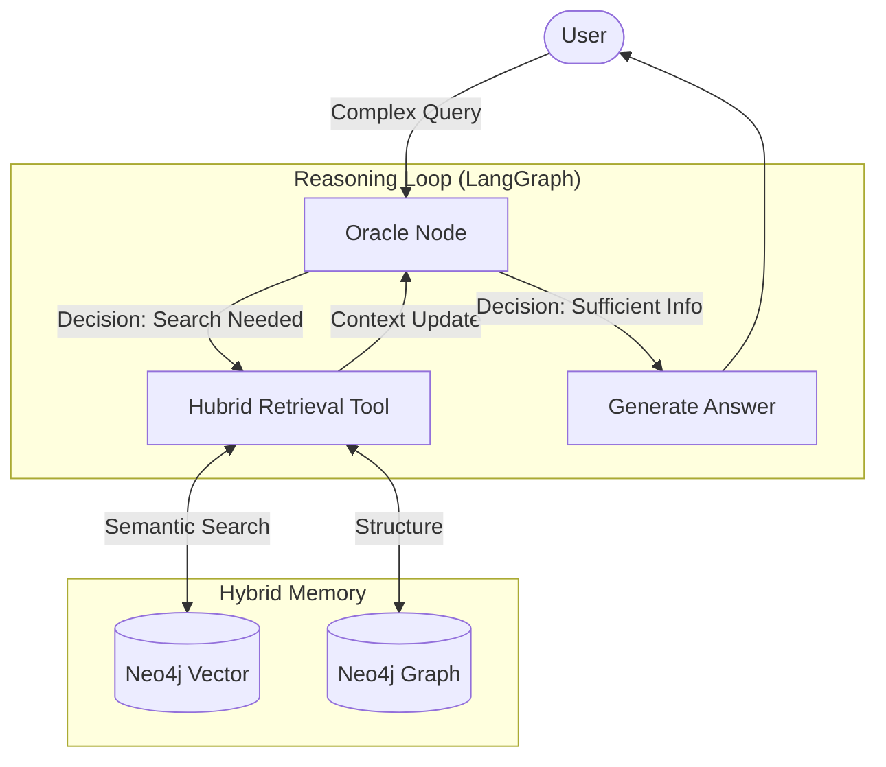

# Onpremise LLM: Local RAG Engine


Onpremise LLM은 로컬 LLM (Ollama)과 지식 그래프 (Neo4j)를 결합하여 복잡한 문서 간의 관계를 추론하는 Agentic RAG 시스템입니다. 단순 검색을 넘어, 에이전트가 질문을 분석하고 필요한 정보를 "탐색"하여 논리적인 답변을 생성합니다.

---

## Cognitive Architecture (아키텍처)

본 시스템은 LangGraph를 기반으로 "계획(Plan) - 검색(Retrieve) - 답변(Answer)"의 순환 과정을 수행합니다.



### Core Components
| Component | Technology | Role |
| :--- | :--- | :--- |
| LLM | Ollama (`llama3.1`) | 로컬 추론 엔진 (무료, 보안 우수) |
| Brain | LangGraph | 에이전트 상태 관리 및 의사결정 루프 제어 |
| Memory | Neo4j | 지식 그래프(관계) + 벡터 인덱스(의미) 하이브리드 저장소 |
| Embedding | HuggingFace (`BGE-M3`) | 한국어/영어 성능이 우수한 고밀도 임베딩 모델 |
| UI | Chainlit | ChatGPT 스타일의 비동기 웹 채팅 인터페이스 |

---

## Project Structure (구조)

```bash
d:\my_rag_system
├── data_raw/               # [Input] 사용자가 학습시킬 문서 (PDF, HWP, CSV)
├── src/
│   ├── agent/              # [Brain] 에이전트 로직
│   │   ├── graph.py        # LangGraph 워크플로우 (Oracle Node 등)
│   │   └── tools.py        # 검색 도구 (Neo4j Vector Search)
│   ├── features/           # [Core] 데이터 처리 모듈
│   │   ├── graph/          # Neo4j 커넥터 (Ingestion)
│   │   └── universal_parser.py # 문서 파서
│   ├── pipeline/           # [Scripts] 실행 스크립트
│   │   ├── build_graph.py  # 1. 그래프 구축 (Entity Extraction)
│   │   └── create_vector_index.py # 2. 벡터 인덱싱
│   └── config.py           # 환경 설정
├── app_chainlit.py         # [UI] 웹 채팅 애플리케이션
└── requirements.txt        # 의존성 목록
```

---

## Getting Started (시작하기)

### 1. Prerequisites (준비사항)
1. Ollama 실행: `llama3.1` 모델이 풀링되어 있어야 합니다.
   ```bash
   ollama pull llama3.1
   ```
2. Neo4j 실행: 로컬 DB 또는 Aura Cloud DB 연결 정보 준비.

### 2. Installation
```bash
pip install -r requirements.txt
```

### 3. Configuration (`.env`)
```ini
NEO4J_URI=bolt://localhost:7687
NEO4J_USERNAME=neo4j
NEO4J_PASSWORD=my_password
OLLAMA_BASE_URL=http://localhost:11434
```

---

##  Data Pipeline (데이터 학습)

"나만의 데이터로 학습시키기"

### Step 1: 지식 그래프 구축
문서를 파싱하고, LLM을 통해 주요 개념(Entity)을 추출하여 그래프를 생성합니다.
```bash
python src/pipeline/build_graph.py --input_dir data_raw
```

### Step 2: 벡터 인덱스 생성
구축된 그래프 데이터를 기반으로 의미 기반 검색(Vector Search)을 위한 인덱스를 생성합니다.
```bash
python src/pipeline/create_vector_index.py
```

---

## Usage (사용법)

웹 인터페이스를 실행하여 에이전트와 대화합니다. 질문의 의도를 파악하여 자동으로 지식 그래프를 탐색합니다.

```bash
python -m chainlit run app_chainlit.py -w --port 8501
```
- 접속: [http://localhost:8501](http://localhost:8501)

---

## Evaluation (성능 평가)

RAGAS 프레임워크를 사용하여 검색 정확도와 답변 품질을 평가할 수 있습니다.
```bash
python src/pipeline/evaluate.py
```
- 결과: `data/evaluation_results.csv`에 Faithfulness, Answer Relevancy 점수 저장.
